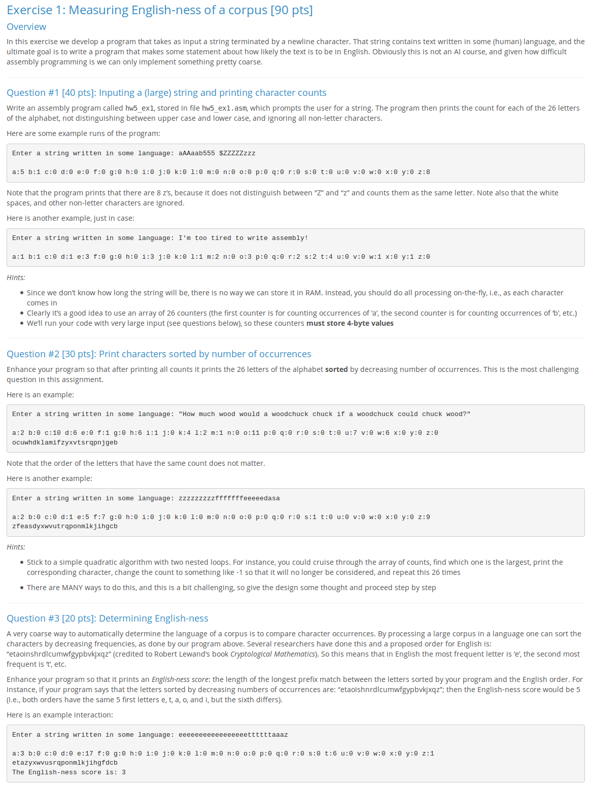

# Measuring-English-ness-X86
Measuring English-ness in X86 Assembly for ICS 312



Compile and Run:
```
$ make
$ ./hw5_ex1
```

Run with one line file:
```
$ cat onelinefilename.txt | hw5_ex1
```

Test with files provided:
```
$ python test.py
```
